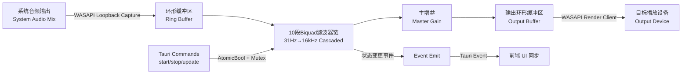

## 产品概述

在 NexBox 内置工具页面中新增 EQ 调音功能模块。通过 WASAPI Loopback 技术捕获 Windows 系统全局音频输出，经 10 段双二阶滤波器（Biquad Filter）实时处理后输出至播放设备，实现系统级音频均衡器效果。用户可通过主开关一键启停 EQ 处理管线，并使用频段滑块独立调节各频段增益。

## 核心功能

- **主开关控制**：一个开关同时控制音频捕获管线与 EQ 效果的总启停，关闭后系统音频恢复直通
- **10 段频率调节**：31Hz、63Hz、125Hz、250Hz、500Hz、1kHz（中置）、2kHz、4kHz、8kHz、16kHz，每段独立滑块，增益范围 -12dB 至 +12dB，步进 0.5dB
- **音频设备选择**：列出系统输出设备，用户指定 EQ 处理后音频的播放目标设备
- **预设管理**：内置游戏/FPS、音乐、电影、语音、自定义等预设方案，支持一键切换
- **设置持久化**：EQ 频段增益、当前预设、主开关状态自动保存至 settings.json，应用重启后恢复
- **实时同步**：后端 EQ 开关状态变更时通过 Tauri 事件推送到前端，确保 UI 与实际设备状态一致

## 技术栈

- **前端**：React 18 + TypeScript + Chakra UI v2 + Framer Motion
- **后端**：Tauri 2.10 + Rust (edition 2021)
- **音频引擎**：Windows WASAPI (Windows Audio Session API) 通过 `windows` crate 调用 COM 接口
- **EQ 算法**：RBJ Audio EQ Cookbook Biquad Filter（直接 II 型实现）
- **状态管理**：Rust `static Mutex<Option<AudioPipeline>>` + `AtomicBool`；前端 `useState` + Tauri `invoke`/`listen`
- **持久化**：`@tauri-apps/plugin-store` + `LazyStore("settings.json")`

## 实现方案

### 整体策略

采用 **Tauri 命令驱动 + 后台线程处理** 的架构：Rust 后端负责所有音频 I/O 和 EQ 运算，通过 Tauri 命令接口暴露控制能力，通过事件机制向前端推送状态变更。前端仅作为 UI 控制面板，不直接参与音频处理。

### 音频管线架构



### 核心技术决策

1. **WASAPI Loopback + Shared Mode**：使用 `AUDCLNT_SHAREMODE_SHARED` + `AUDCLNT_STREAMFLAGS_LOOPBACK` 标志创建捕获客户端，直接从系统混音器获取音频流，无需虚拟音频驱动。

2. **Biquad 滤波器实现**：采用 RBJ Peaking EQ 公式计算系数，直接 II 型结构（每段只需 5 次乘加 + 2 个延迟状态），10 段级联总计算量约 50 次乘加/样本。在 48kHz/32bit float 条件下，10 段 EQ 的 CPU 开销极低（低于 0.1%）。

3. **双缓冲线程模型**：主音频处理线程使用两个环形缓冲区（捕获 → 输出），通过 `std::sync::Condvar` 协调读写。线程在 `AtomicBool` 控制下运行/停止。

4. **COM 初始化**：处理线程启动时调用 `CoInitializeEx(MULTITHREADED)`，使用 `IMMDeviceEnumerator` 获取音频设备，通过 `IAudioClient::Initialize` 配置捕获和渲染客户端。

### 性能考量

- **缓冲区大小**：使用 WASAPI 引擎周期（engine period ~10ms），延迟控制在 10-30ms
- **EQ 计算**：10 段级联 Biquad 基于 f32 运算，无堆分配，纯栈操作
- **内存**：约为 2 × buffer_frames × 2 channels × sizeof(f32) ≈ 4 KiB
- **线程安全**：AtomicBool 控制启停（无锁），Mutex 仅在设置更新时短暂持锁

## 架构设计

### 模块划分

| 模块 | 文件 | 职责 |
| --- | --- | --- |
| 音频管线模块 | `src-tauri/src/audio_eq.rs` | WASAPI 初始化和 COM 交互、音频捕获/渲染客户端管理、Biquad 滤波器链、后台处理线程、Tauri 命令 |
| EQ 调音页面 | `src/pages/EqTuningPage.tsx` | 10 段滑块 UI、主开关、预设选择器、设备选择器、LazyStore 持久化 |
| 模块注册 | `src-tauri/src/lib.rs` | mod 声明、命令注册、cleanup 调用 |


### 数据流

```
用户拖动滑块 → onChange → setLocalState → 防抖(100ms) → invoke("update_eq_settings")
                                                              ↓
                                                       Rust Mutex 更新
                                                              ↓
                                                  音频处理线程下次迭代生效

用户切换开关 → invoke("start_eq"/"stop_eq") → Rust 设置 AtomicBool
                                                      ↓
                                              启动/停止 WASAPI 管线
                                                      ↓
                                              app.emit("eq-status-changed") → 前端 listen → setEnabled
```

## 实现细节

### 目录结构

```
d:/NexBox/
├── src-tauri/
│   ├── src/
│   │   ├── audio_eq.rs          # [NEW] 完整音频EQ管线模块
│   │   └── lib.rs               # [MODIFY] 注册audio_eq模块+命令+cleanup
│   └── Cargo.toml               # [MODIFY] 添加Win32_Media_Audio feature
└── src/
    ├── pages/
    │   ├── EqTuningPage.tsx     # [NEW] EQ调音UI页面
    │   └── BuiltinToolsPage.tsx # [MODIFY] tools数组添加EQ入口卡片
    ├── App.tsx                  # [MODIFY] 添加/eq-tuning路由
    └── locales/
        └── zh.json              # [MODIFY] 添加sidebar/builtinTools/eqTuning翻译键
```

### 关键代码结构

**EQ 设置数据结构**：

```rust
// audio_eq.rs
#[derive(serde::Serialize, serde::Deserialize, Clone, Debug)]
pub struct EqSettings {
    pub enabled: bool,
    pub bands: [f32; 10],           // 10段增益, -12.0..12.0 dB
    pub master_gain: f32,           // 主增益, -20.0..6.0 dB
    pub output_device_id: String,   // 输出设备ID
    pub preset_id: String,          // 当前预设标识
}
```

**Biquad 滤波器抽象**：

```rust
struct BiquadFilter {
    b0: f32, b1: f32, b2: f32,
    a1: f32, a2: f32,
    z1: f32, z2: f32,  // 延迟状态
}

impl BiquadFilter {
    fn peaking_eq(freq: f32, q: f32, gain_db: f32, sample_rate: f32) -> Self;
    fn process(&mut self, sample: f32) -> f32;  // Direct Form II
}
```

**Tauri 命令签名**：

```rust
#[tauri::command] fn start_eq() -> Result<EqSettings, String>;
#[tauri::command] fn stop_eq() -> Result<(), String>;
#[tauri::command] fn get_eq_status() -> Result<EqSettings, String>;
#[tauri::command] fn update_eq_settings(settings: EqSettings) -> Result<(), String>;
#[tauri::command] fn get_audio_devices() -> Result<Vec<AudioDeviceInfo>, String>;
```

### 执行要点

1. **`windows` crate feature 添加**：在 Cargo.toml 的 `windows = { version = "0.58", features = [...] }` 中添加 `"Win32_Media_Audio"` 和 `"Win32_Media"` features，以访问 WASAPI COM 接口。

2. **线程清理保障**：音频处理线程必须使用 `AtomicBool` 作为退出标志。`stop_eq` 命令设置标志为 false 后通过 `thread::JoinHandle` 等待线程退出。`cleanup()` 确保应用退出时释放所有 COM 资源并 `CoUninitialize()`。

3. **格式转换**：WASAPI Loopback 捕获格式（mix format）可能与渲染设备接受的格式不同。需要在管线中处理采样率转换或声道映射的情况。推荐优先使用共享模式默认的 `WAVEFORMATEX`。

4. **向后兼容**：audio_eq.rs 中的全局状态在首次启动时为空（`Mutex<Option<...>>`），所有命令需处理"管线未启动"的边界情况，返回描述性错误信息。

5. **日志**：使用 `log::info!`/`log::warn!` 记录管线启动、停止、设备信息、COM 错误等关键事件，遵循项目现有的日志规范。

## 设计风格

采用 **Neumorphism x Glassmorphism 融合风格**，延续项目 LiquidGlassCard 的毛玻璃设计语言。以暗色主题为主基调，频段滑块采用渐变着色条，中置频率 (1kHz) 使用强调色区分。开关控件使用发光 toggle 效果，预设卡片使用圆角毛玻璃面板。

## 页面布局

页面采用单页垂直滚动布局，从上到下分为四个功能区块：

### 区块一：顶部导航栏

- 返回箭头按钮（回到内置工具页）+ 页面标题"EQ 调音"
- 右侧区域：主开关（发光圆角 Switch，开启时显示绿色呼吸动画）+ 状态指示文字

### 区块二：预设选择区

- 水平滚动的预设卡片列表（游戏/FPS、音乐、电影、语音、自定义 ×2）
- 每张卡片为圆角毛玻璃面板，内含预设名称和迷你频段预览条
- 当前选中的预设卡片具有彩色边框高亮效果

### 区块三：10 段均衡器调节区

- 10 个垂直排列的频段调节组件，每条包含：
- 左侧：频率标签（31Hz~16kHz），1kHz 使用强调色
- 中部：水平 Slider（Chakra UI Slider），-12dB ~ +12dB 范围，0.5dB 步进
- 滑块轨道使用渐变色（低→高频率方向），已填充轨道使用主题色
- 右侧：当前增益值数字显示（精确到 0.5dB）
- 底部主增益旋钮：独立的水平滑块，-20dB ~ +6dB 范围

### 区块四：音频设备选择

- 下拉选择框（Chakra UI Select/menu），列出系统输出设备
- 当前选中设备以图标 + 名称形式展示

## Agent Extensions

### SubAgent

- **code-explorer**
- 用途：在实现阶段搜索现有 Tauri 命令注册模式、Chakra UI 组件用法、i18n 翻译键定义位置
- 预期结果：准确定位所有需要修改的文件位置和代码插入点