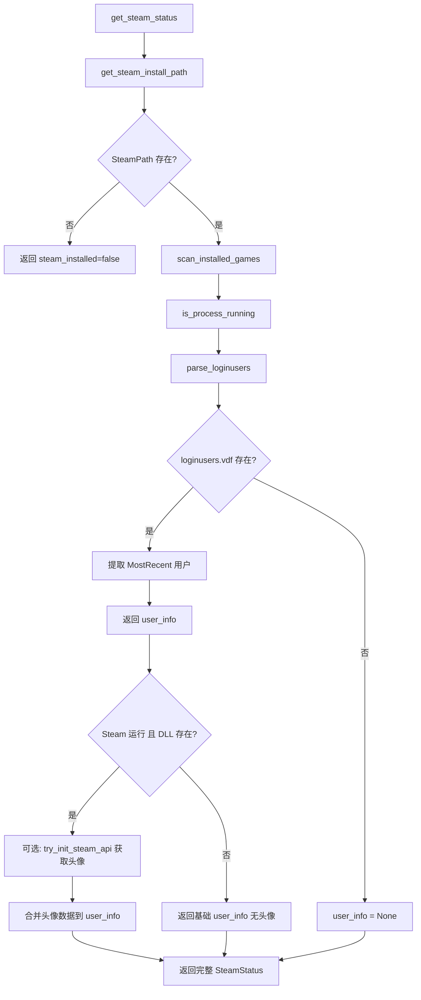

## 用户需求

参考 SteamTools-develop（Watt Toolkit）的架构，重构 NexBox 的 Steam 集成模块，核心目标是将用户信息获取方式从不稳定的 `steam_api64.dll` 动态加载改为可靠的本地文件解析。

## 产品概述

通过解析 `<SteamDir>/config/loginusers.vdf` 文本文件获取用户信息，不再依赖 Steam API DLL。同时修复游戏库扫描逻辑，确保能正确发现所有 Steam 库文件夹中的已安装游戏。

## 核心功能

- 解析 `loginusers.vdf` 获取用户信息（SteamID64、PersonaName、MostRecent 标志），无需 Steam API
- Steam API DLL 降级为可选增强：仅在 DLL 存在且 Steam 运行时尝试获取头像，不阻塞用户信息返回
- 修复游戏库扫描：正确遍历所有库文件夹的 `steamapps/` 目录读取 ACF 文件
- 清理排障阶段添加的大量调试日志，保留关键信息日志
- 保持前端 SteamCard 组件接口完全兼容

## 技术栈

- 后端：Rust + Tauri 2.x（复用已有的 VDF 文本解析器、注册表读取、进程检测）
- 前端：React + TypeScript + Chakra UI（SteamCard 组件接口不变）
- 平台：Windows（注册表 `HKCU\Software\Valve\Steam`）
- 依赖：`winreg`、`sysinfo`、`libloading`（已有），不引入新 Cargo 依赖

## 实现方案

### 核心策略：loginusers.vdf 替代 Steam API DLL

参考 SteamTools（Watt Toolkit）的做法，用户信息完全从本地文件读取：

1. **loginusers.vdf 位置**：`<SteamPath>/config/loginusers.vdf`
2. **文件格式**：文本 VDF，根节点 `"users"`，子节点以 SteamID64 字符串编号
3. **每个用户节点包含**：`AccountName`、`PersonaName`、`MostRecent`（"0"/"1"）、`Timestamp`、`RememberPassword` 等键值对
4. **当前用户判定**：查找 `MostRecent` 值为 `"1"` 的节点

现有代码已有完整的 VDF 文本解析器（`parse_vdf`、`parse_vdf_node`、`vdf_child`、`vdf_child_value`），只需新增 `parse_loginusers()` 函数调用这些已有工具。无需引入任何新依赖。

### 用户信息获取流程重构



### 游戏库扫描修复

当前问题：`scan_installed_games` 只找到了 `d:/steam/steamapps` 和 `D:\Steam\steamapps`（同一目录），两个目录都有 0 个 ACF 文件。

参考 SteamTools 的做法，更健壮的多库发现策略：

1. 优先从 `SteamExe` 父目录读取 `libraryfolders.vdf`（主 VDF 文件）
2. 遍历 VDF 中列出的所有库路径的 `steamapps/` 目录
3. 额外检查 `SteamPath/steamapps/`（作为保险回退）
4. 每个 `steamapps/` 目录中搜索 `appmanifest_*.acf` 解析游戏信息
5. 返回去重（按路径大小写不敏感）后的游戏列表

### 清理调试日志

移除之前排障阶段添加的高频日志：

- `parse_library_folders` 中的逐步骤日志
- `scan_installed_games` 中的每目录条目采样日志
- `is_process_running` 中的进程列表大小日志
- `get_steam_client_dir_for_vdf` 中的 VDF 检查日志

保留关键日志：Steam 进程检测结果、游戏扫描总数、loginusers 解析结果、API 初始化失败原因。

### 性能与可靠性

- **loginusers.vdf**：文件通常 < 1KB，解析耗时 < 1ms，无网络开销
- **游戏扫描**：遍历文件系统，建议只在该命令被调用时执行（已有 Tauri command 封装）
- **Steam API**：仅在 DLL 存在时才尝试加载，失败不阻塞主流程
- **向后兼容**：`SteamStatus`、`SteamUserInfo`、`SteamGame` 结构完全不变，前端零改动

## 目录结构

```
src-tauri/src/
├── steam.rs          # [MODIFY] 重构 Steam 集成模块
│   # 新增函数：
│   #   - parse_loginusers() -> Option<(u64, String)>  解析 loginusers.vdf 获用户信息
│   #   - collect_steamapps_paths() -> Vec<PathBuf>      收集所有 steamapps 目录路径
│   # 
│   # 保留函数（不变）：
│   #   - parse_vdf / parse_vdf_node / vdf_child / vdf_child_value
│   #   - get_steam_install_path / get_steam_exe_path / get_steam_client_dir
│   #   - is_process_running
│   #   - scan_installed_games / parse_library_folders / parse_appmanifest
│   #   - try_init_steam_api / call_get_persona_name / call_get_steam_id / call_get_avatar
│   #   - launch_steam_game / check_steam_running
│   # 
│   # 修改函数：
│   #   - get_steam_status: 重构流程，loginusers 优先，API 可选增强
│   #   - scan_installed_games: 修复多库发现逻辑，清理日志
│   #   - write_steam_appid_file: 保留（API init 仍需）
│   # 
│   # 移除函数：
│   #   - get_steam_client_dir_for_vdf: 不再需要，合并到 collect_steamapps_paths
│   #
│   # 清理内容：
│   #   - 移除 scan_installed_games 中的 all_entries/samples 日志
│   #   - 移除 parse_library_folders 中的 VDF 逐步骤日志
│   #   - 移除 is_process_running 中的进程总数日志
│   #   - 简化 get_steam_client_dir_for_vdf 的调试日志
│   #   - 精简为仅保留关键信息级别日志

src/components/
└── SteamCard.tsx     # [不变] 前端组件，接口完全兼容

src/hooks/
└── useSteamCardEnabled.ts  # [不变] 显隐开关 hook
```

## 关键代码结构

### loginusers.vdf 解析函数签名

```rust
/// 解析 loginusers.vdf，返回当前登录用户的 (SteamID64, PersonaName)。
/// 通过 MostRecent="1" 判断当前用户。
fn parse_loginusers(steam_path: &std::path::Path) -> Option<(u64, String)> {
    // 读取 <SteamPath>/config/loginusers.vdf
    // 调用已有 parse_vdf() 解析
    // 遍历根节点 children，找 SteamID 编号节点
    // 检查 MostRecent 是否为 "1"
    // 返回 (steam_id: u64, persona_name: String)
}
```

### get_steam_status 流程简化

```rust
// 1. 路径检测（已有）
// 2. 游戏扫描（修复后）
// 3. 进程检测（已有）
// 4. 用户信息：loginusers.vdf 优先
//    - 成功：user_info = 解析结果（无头像）
//    - 失败：user_info = None
// 5. 头像增强：仅当 Steam 运行且 DLL 存在时
//    - try_init_steam_api(cd)
//    - call_get_avatar(steam_id)
//    - 合并头像数据到已有 user_info
// 6. 返回 SteamStatus
```